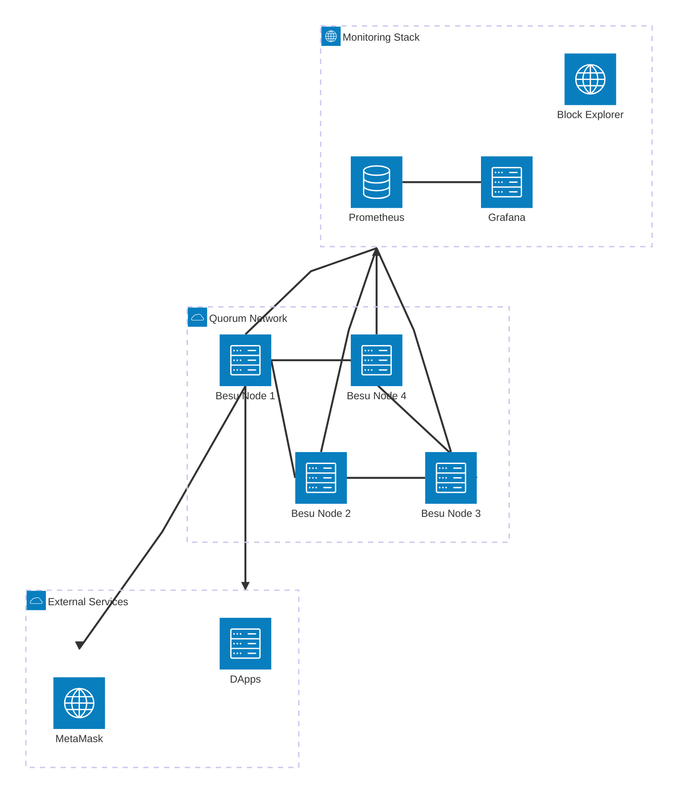
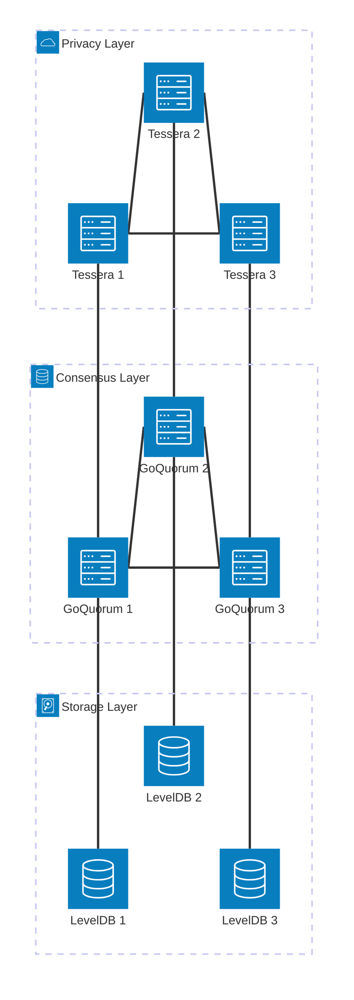
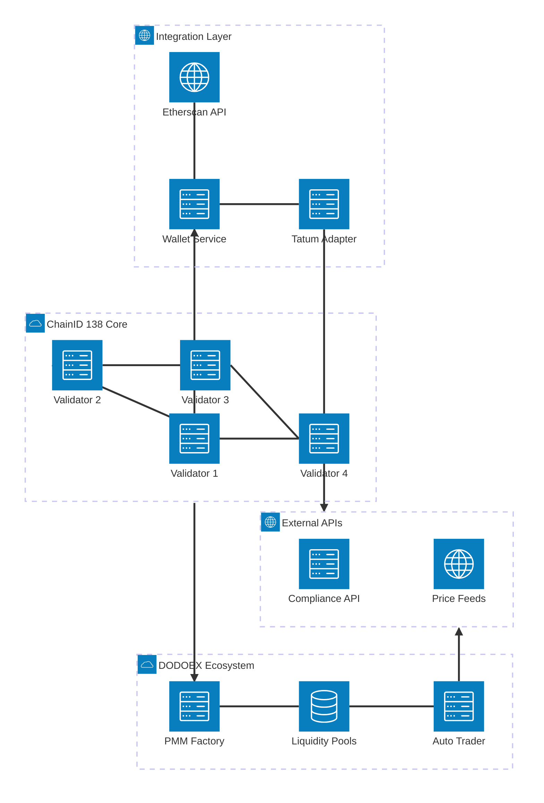
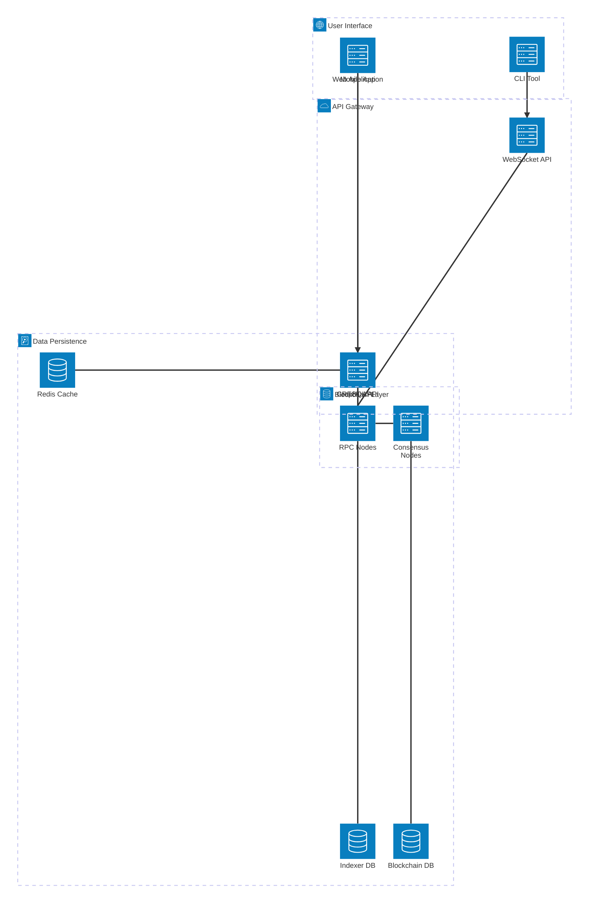
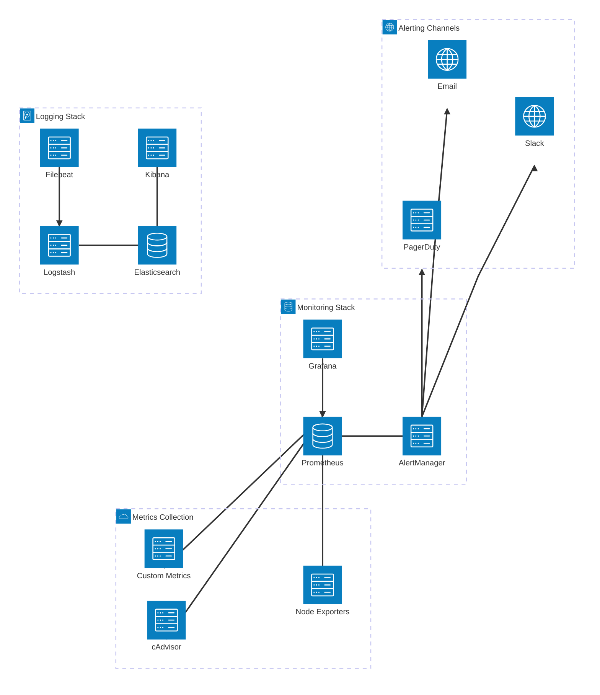

# 🏗️ System Architecture Diagrams

## Network Architecture Overview

## GoQuorum Privacy Architecture

## Regional Topology Architecture

## ChainID 138 Integration Architecture

## Data Flow Architecture

## Monitoring & Observability

